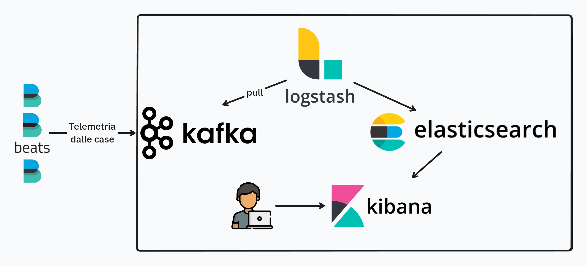

# Progetto Industrial Internet of Things
Questo progetto, originariamente creato per l'esame di Industrial Internet of Things, simula un sistema per il monitoraggio energetico di abitazioni con impianti fotovoltaici (pannelli solari e batterie di accumulo). Le case simulate inviano i dati di telemetria a una soluzione Big Data centralizzata per lo storage, analisi e visualizzazione dei dati.

## Tecnologie e strumenti utilizzati
- Python (con asyncio)
- MQTT
- Docker, Docker compose
- Filebeat
- Apache Kafka
- Logstash
- Elasticsearch
- Kibana

## Quickstart
```bash
docker compose up
```
Poi aprire un browser e collegarsi all'indirizzo di Kibana (di default, http://localhost:5601) per visualizzare le dashboard.
> [!IMPORTANT]  
> Impostare correttamente la finestra temporale su Kibana o non si vedranno i dati. Ad esempio, se si è impostato l'inizio della simulazione a "2025-01-01 00:00", il campo "Start date" andrà impostato a quel valore.
>
> 


Per vedere nel dettaglio il funzionamento di una delle case:
```bash
docker exec -it nome-container-casa tmux -u attach
```
Ad esempio:
```bash
docker exec -it progetto-industrialiot-house-1 tmux -u attach
```


## Dashboard Kibana


## Struttura del progetto
```
.
├── altro/              # Script ausiliari, leftover e strumenti di test/simulazione
├── elaboration/        # Elaborazione dati per generazione bollette
├── elastic/            # Container Elasticsearch con configurazioni
├── house/              # Simulazione casa e suoi componenti
├── kibana/             # Container Kibana e dashboard
├── logstash/           # Configurazione per Logstash
├── .env                # Variabili d'ambiente per docker-compose
├── docker-compose.yml  # Definizione dei servizi Docker
└── README.md           # Documentazione del progetto
```

## Configurazione `.env`
Si possono configurare vari parametri della simulazione, attraverso alcune variabili di ambiente all'interno del file `.env`. Di seguito vengono elencati tutti i parametri disponibili con la relativa descrizione:

### Parametri obbligatori

| Variabile | Descrizione |
|-----------|-------------|
| `STACK_VERSION` | Versione numerica dello stack da utilizzare. Deve essere un numero esplicito (es. `9.0.0`) e **non** può essere `"latest"`. Vedere [qui](https://hub.docker.com/_/elasticsearch). |
| `HOUSES` | Numero di case da simulare. Ogni casa consuma circa **150 MB di RAM**. |
| `SIMULATION_START` | Data e ora di inizio della simulazione nel formato **`"%Y-%m-%d %H:%M"`**. Esempio valido: `"2025-01-01 00:00"`. |
| `SIMULATION_STEP` | Intervallo di tempo simulato per ogni step. Deve essere una stringa in formato naturale (es. `"1 hour"` o `"2 hours 30 minutes"`). Valori validi: **tra 1 e 24 ore**. |
| `SIMULATION_SPEED` | Tempo reale (in secondi, anche decimale) da attendere tra uno step e l'altro della simulazione. Deve essere **maggiore o uguale a 5**. |
| `SIMULATION_HOW_MANY_STEPS` | Numero massimo di step della simulazione. Se impostato a `0` o non definito, la simulazione continuerà indefinitamente finché non viene interrotta manualmente. |
| `BILL_DAYS` | Ogni quanti **giorni simulati** generare le bollette per i clienti. La prima bolletta verrà emessa dopo il numero di giorni specificato, e poi ciclicamente. |

### Esempio di file `.env`

```env
STACK_VERSION=9.0.0
HOUSES=5
SIMULATION_START="2025-01-01 00:00"
SIMULATION_STEP="1 hour"
SIMULATION_SPEED=5
SIMULATION_HOW_MANY_STEPS=0
BILL_DAYS=7
```
> [!IMPORTANT]  
> La simulazione è più affidabile con un SIMULATION_STEP il più piccolo possibile ("1 hour"). Più si aumenta la lunghezza dello step, meno la simulazione sarà accurata.


## Simulazione delle case
Le case simulate sono composte da vari componenti, descritti di seguito:
```
house/
├── charge_controller.py  # Controller di carica delle batterie
├── electric_panel.py     # Quadro elettrico, gestisce gli scambi di energia
├── house_consumption.py  # Generazione dei profili di consumo energetico
├── inverter.py           # Inverter, raccoglie la produzione di tutti i pannelli solari
├── meteo_manager.py      # Gestione delle condizioni meteo simulate
├── solar_panel.py        # Singoli pannelli solari
├── subscriber.py         # Gateway (concentratore) della casa, raccoglie dati da tutti i dispositivi
└── time_manager.py       # Gestione del tempo simulato
```

I componenti si scambiano informazioni localmente tramite messaggi MQTT. Il broker MQTT è uno per casa.
Per ogni step di simulazione, il flusso delle informazioni è il seguente:
- Ognuno dei pannelli solari (`solar_panel`) produce una certa quantità di energia, a seconda dell'orario e del meteo attuale (`meteo_manager`)
- Il quadro elettrico (`electric_panel`) calcola il consumo richiesto attualmente dalla casa, a seconda dell'orario attuale e dal profilo di consumo
- Quando tutti i pannelli hanno pubblicato la loro produzione, l'inverter (`inverter`) li raccoglie e calcola la produzione totale
- Il quadro elettrico inizia lo scambio di energia, consumando la corrente dei pannelli solari per coprire l'energia richiesta dalla casa in questo momento:
    - Se è sufficiente, la restante viene utilizzata per caricare le batterie (`charge_controller`)
        - Se le batterie, così facendo, si caricano al 100%, il restante viene immesso in rete
    - Altrimenti, l'energia ancora da fornire viene prelevata dalle batterie
        - Se le batterie non possono fornirla tutta, la restante viene prelevata dalla rete
- Il gateway della casa (`subscriber`) raccoglie tutte le informazioni dello step attuale e le scrive su un file di log (`log.ndjson`) che verrà monitorato da Filebeat e inviato a Kafka, il punto di ingresso della soluzione Big Data centralizzata.


## Big Data pipeline
La Big Data pipeline realizzata si compone delle seguenti tecnologie:
- Ogni casa ha il suo **Filebeat** che invia i dati a Kafka
- **Apache Kafka** è il punto di ingresso dell'intera soluzione. Grazie alle sue elevate prestazioni è un'ottima scelta per ricevere i dati di telemetria inviati dalle case
- Il resto della pipeline è composto dallo **stack Elastic**:
    - **Logstash** fa il *pull* dei dati da Kafka, li pre-processa (rimuove alcuni campi per snellire il payload e ne trasforma altri per prepararli) e li manda ad Elasticsearch
    - **Elasticsearch** si occupa dello storage dei dati di telemetria, e ne permette il recupero e l'elaborazione (ad esempio per la creazione delle bollette)
    - **Kibana** consente la visualizzazione dei dati attraverso le dashboard create




## Utilizzo di memoria dei vari container
- Elasticsearch: 50% della RAM disponibile sull'host
- Logstash: ~1 GB
- Kibana: ~600 MB
- Kafka: ~400 MB
- Una casa: ~140 MB
- Elaboration: ~20 MB

<!--
> [!NOTE]  
> Highlights information that users should take into account, even when skimming.

> [!TIP]
> Optional information to help a user be more successful.

> [!IMPORTANT]  
> Crucial information necessary for users to succeed.

> [!WARNING]  
> Critical content demanding immediate user attention due to potential risks.

> [!CAUTION]
> Negative potential consequences of an action.
-->